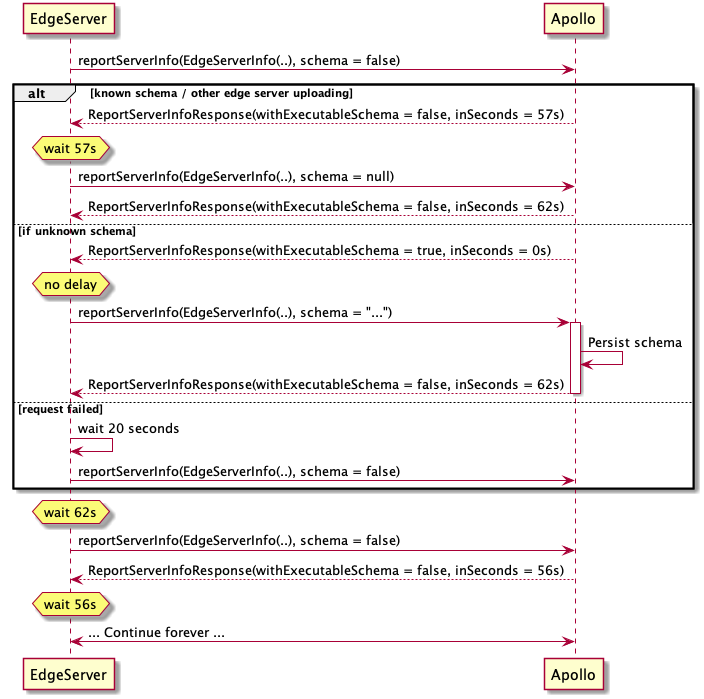

# Automatic Schema Reporting Protocol

# Intro

The goal of this document is to provide the technical details of implementing schema reporting to the Apollo schema registry. Any GraphQL server can write a reporting client to this protocol to enable this functionality. For the purpose of this document, these servers will be referred to as Edge Servers. For a reference reporting client, please see [Apollo Server](https://github.com/apollographql/apollo-server/pull/4084/files).

# Glossary

*  **Schema**: A GraphQL document (sometimes referred to as SDL)
*  **Edge Server**: A GraphQL server that contains an Apollo API key
* **Executable schema**: The schema that the edge server is exposing to the client, which is used to generate the introspection result. This schema may contain comments and directives or may not and should be represented as a GraphQL document.
* **Executable schema identifier**: The hex representation of the sha256 of the executable schema document
* **Apollo**: The Apollo cloud schema registry

# The Automatic Schema Reporting Protocol



## Spec

```
input EdgeServerInfo {
  bootId: String!
  executableSchemaId: String!
  graphVariant: String! = "current"
  libraryVersion: String
  platform: String
  runtimeVersion: String
  serverId: String
  userVersion: String
}

type ReportServerInfoResponse {
  inSeconds: Int!
  withExecutableSchema: Boolean!
}

type Mutation {
  service(id: ID!): ServiceMutation!
}

type ServiceMutation {
  reportServerInfo(
    "Only sent if previously requested i.e. received ReportServerInfoResponse with withExecutableSchema = true"
    executableSchema: String,
    info: EdgeServerInfo!
  ): ReportServerInfoResponse
}

```

1. An Edge server calls `reportServerInfo` with the `EdgeServerInfo` input and without a schema.
    1. In case this request fails (non 2xx response), the Edge server should try again after a 20s delay.
2. The server replies with a `ReportServerInfoResponse`. This response tells the Edge server how long to wait before sending the next report and whether to include the schema that corresponds to the `executableSchemaId` sent in the request.
3. The Edge server calls `reportServerInfo` again after `response.inSeconds` seconds, and includes a schema if `response.withExecutableSchema` is `true`.
4. GO TO (2)

## EdgeServerInfo fields

* _Required:_
    * **`bootId`**: a randomly generated UUID, immutable for the lifetime of the server runtime.
    * **`executableSchemaId`**
        * This is an identifier decided by the edge server. This should be the sha256, represented in hex, of the schema document.
    * **`graphVariant`**: the graph variant, defaults to `"current"`.
* _Optional, recommended:_
    These values will eventually be available on Graph Manager and will allow users to have a better understanding of what was reported, when, and from where.
    * **`serverId`**: _If available_, an identifier for the instance, such that when restarting this instance it will have the same **`serverId`**, with a different **`bootId`**. In a kubernetes cluster, this might be the **pod** **name**, where the **container** can restart.
    * `**userVersion**`: an arbitrary string the user can set, so that they could distinguish data on the server by this string. For example this can be the git sha of the repository of the user. We plan to make this visible on Graph Manager.
* _Optional, for Apollo’s use:_
    These values will significantly help Apollo improve its service, for example, by enabling us to identify if certain environments/platforms/versions suffer from certain issues.
    * **`runtimeVersion`**: The runtime in which the edge server is running, e.g. `node 12.03`
    * **`libraryVersion`**: The library of the running server & reporting agent, e.g. `apollo-server-2.8` , `graphql-java-3.1`
    * **`platform`**: The infra environment in which this server is running, e.g. `localhost`, `kubernetes/deployment`, `aws lambda`, `google cloud run`, `google cloud function`, `AWS ECS`, etc.

## Edge server side normalization

On the edge server, we’ll expect reporting client to take these steps to ensure a stable schema document:

1. stable sort ordering of type definitions
2. stable sort ordering of fields in types
3. stable sort ordering of arguments
4. remove redundant whitespace
5. remove comments (not *descriptions*)

Any runtime dependencies of the schema document may result in poor user experience in tracking your schema changes and could result in throttling of service availability.

### Pseudo Code example

```
val info = EdgeServerInfo(..)
val schema = normalize("type Query { .. }")
var withSchema = false

function sendReport() {
  val executableSchema = if (withSchema) null else schema
  val response = reportServerInfo(info, executableSchema)

  if (response.withExecutableSchema) {
    withSchema = true
  }

  setTimeout(sendReport, response.inSeconds)
}

sendReport()
```
